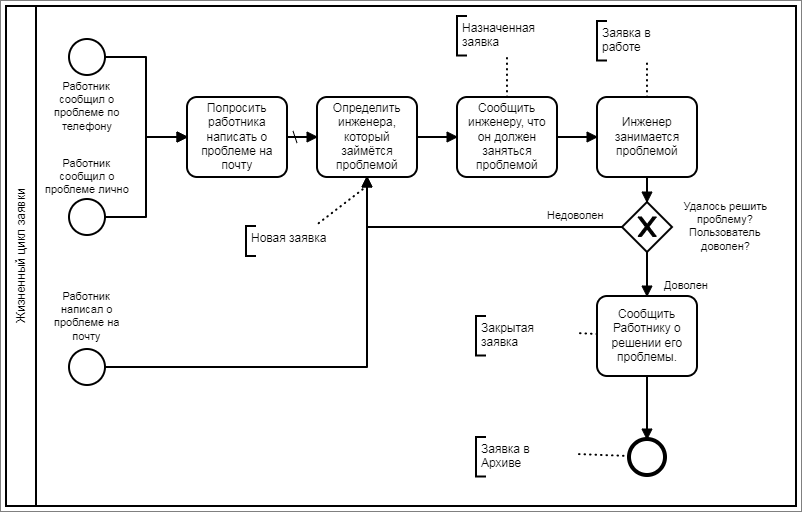

## For Future Sprints
* Добавить инженеров (пока что это текстовое поле)
* Добавить авторизацию (пока что это одна админская учётка)
* Добавить рабочие места у Работников
  

## Sprint 002 (05 - 18 September 2022)

**UserStory 002** \
Как инженер отдела тех. поддержки, \
Хочу видеть список всех заявок и их статусов выделенных цветом, \
Чтобы быстро понимать какие задачи нужно взять в работу, какие уже делают, а какие сделаны.

**UserStory 003** \
Как инженер отдела тех. поддержки, \
Хочу иметь возможность по двойному щелчку открывать заявку на редактирование, \
Чтобы быстро вносить в неё изменения по ходу движения по жизненному циклу.

**UserStory 004** \
Как инженер отдела тех. поддержки, \
Хочу по кнопке + быстро создавать новую заявку, \
Хочу чтобы можно было быстро найти сотрудника, \
Хочу чтобы можно было быстро найти оборудование этого сотрудника, \
Чтобы понимать куда идти и с каким оборудованием работать.


**Жизненный цикл заявки** \


**Заявка может иметь статусы:**
* Новая / Created (заявка только пришла) - #F0B9B9 (светло розовый)
* Назначенная / Appointed (заявку назначили сотруднику для работы) - #FEDD9E (светло оранжевый)
* В работе / Working (сотрудник начал работать над заявкой) - #B8E7FF (светло голубой)
* Закрытая / Completed (работы по задаче выполненны, ожидается фитбек)
* Архив / Archived (Спустя время) - #EDEBEB (светло серая)


**Чтобы реализовать данные истории, нужно:**
```
Add Tickets
    Add TicketsStatus           - 1 sp
    Add backend Ticket          - 3 sp
    Add frontend TicketList     - 2 sp
    Add frontend TicketEdit     - 4 sp
    Add frontend findEmployee   - 3 sp

Total:                          - 13 sp
```


## Sprint 001 (22 August 2022 - 05 September 2022)

**UserStory 001** \
Как сотрудник организации, \
Хочу видеть список всех коллег разбитых по отделам, \
Чтобы быстро находить их телефоны, почты, кабинеты, их начальников и подчинённых.

**Чтобы реализовать данную историю, нужно:**
```
Add Departments
    Add backend Departments      - 3 sp
    Add frontend Departments     - 5 sp
    Fill DB Departments          - 1 sp

Add Employees
    Add backend Employees        - 5 sp
    Add frontend Employees       - 5 sp
    Fill DB Employees            - 2 sp

Total:                           - 21 sp
```